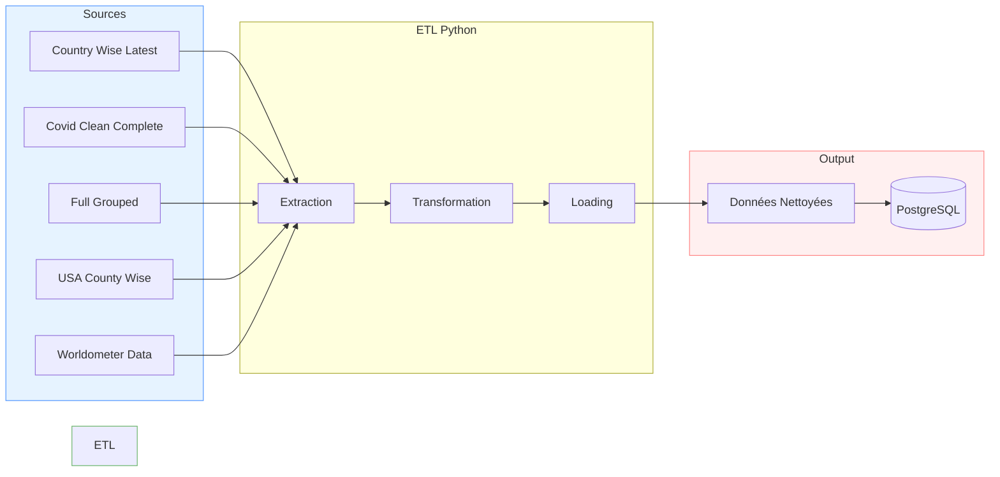

# Vue d'Ensemble de l'Architecture

## Structure générale

## Composants principaux

### 1. Sources de données

- Multiples fichiers CSV
- Données sur les cas COVID-19
- Informations démographiques
- Statistiques par pays

### 2. Processus ETL

- Scripts Python
- Notebooks Jupyter
- Bibliothèques de traitement de données

### 3. Stockage

- Fichiers CSV intermédiaires
- Base de données PostgreSQL

## Flux de données

### Extraction

- Lecture des fichiers sources
- Validation initiale des données

### Transformation

- Nettoyage
- Standardisation
- Agrégation

### Chargement

- Export CSV
- Insertion en base de données

[Next](choix-techniques.md)